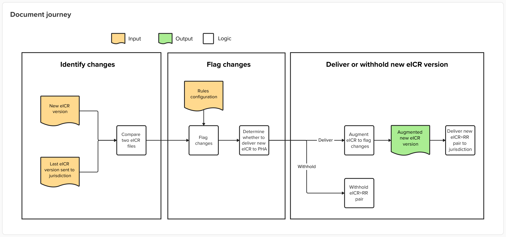
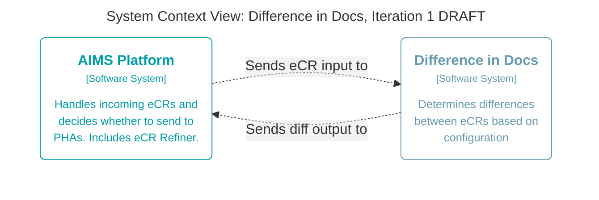

# DIBBs Difference in Docs

**General disclaimer** This repository was created for use by CDC programs to collaborate on public health related projects in support of the [CDC mission](https://www.cdc.gov/about/cdc/#cdc_about_cio_mission-our-mission).  GitHub is not hosted by the CDC, but is a third party website used by CDC and its partners to share information and collaborate on software. CDC use of GitHub does not imply an endorsement of any one particular service, product, or enterprise. 

## Related documents

* [Open Practices](open_practices.md)
* [Rules of Behavior](rules_of_behavior.md)
* [Thanks and Acknowledgements](thanks.md)
* [Disclaimer](DISCLAIMER.md)
* [Contribution Notice](CONTRIBUTING.md)
* [Code of Conduct](code-of-conduct.md)
* [Augmentation](docs/Augmentation.md)
* [Telemetry Semantics](docs/Telemetry-Semantics.md)

## Overview

DIBBs Difference in Docs (DiD) is a project aimed at helping Public Health Authorities (PHAs) better leverage electronic case reporting (eCR) by reducing the frequency of updates to electronic Initial Case Reports (eICRs). This will allow them to identify updates that are actionable to their public health activities.

DiD is deployed as an AWS Lambda Function on the Association of Public Health Laboratories (APHL) AIMS Platform.

### The Problem

Electronic case reports (eCR) are continuously, automatically updated as changes are made to a patient's electronic health record (EHR). For example, as a patient receives care or their test results are updated, this can lead to a very noisy experience as PHAs try to stay on top of changes to those eICRs.

Oftentimes, small changes occur that aren't of interest to PHAs, or important changes can be missed amid the noise. Additionally, not all updates are flagged clearly which means the PHA must decide whether to invest the human effort or computing resources to scan through each version of an eICR for relevant updates or risk missing important information by batching or ignoring eICRs that come in quick succession. PHAs also need to decide how and whether to store each version of an eCR, which has considerable impacts on their infrastructure footprint.

### How it works

As eICRs pass through APHL's AIMS platform, they are scanned, validated, and delivered according to rules configured by each PHA. DiD enhances that functionality by identifying differences between versions of an eICR, determining whether the changes are actionable based on configurable rules, and marking those changes in an augmented eICR output. If there are actionable changes, AIMS sends the augmented eICR to the PHA. If there are not actionable changes, AIMS can withhold that eICR so PHAs won't receive that unimportant noisy update.

The following diagram shows how an eICR is processed by DiD within the AIMS pipeline.




### Technical Documentation

For more information on Difference in Docs' technical implementation, see the [`docs/`](./docs/) folder.

We recommend starting with the [Technical Overview](docs/01-Technical-Overview.md).



## Repository Structure

The Difference in Docs repository is a [uv workspace](https://docs.astral.sh/uv/concepts/projects/workspaces/) consisting of multiple Python packages under the `packages/` directory.

```
├── docker                    # Docker-related scripts, files, and containerized services
├── docs                      # Difference in Docs documentation
│   └── structurizr           # Structurizr and architecture diagram files
├── e2e                       # End-to-End tests, assets, and snapshots
├── packages
│   ├── cli                   # Command-line interface package
│   │   ├── pyproject.toml
│   │   └── src/
│   ├── core                  # Core Difference in Docs logic and shared modules
│   │   ├── pyproject.toml
│   │   └── src/
│   └── did_lambda            # AWS Lambda Function package
│       ├── pyproject.toml
│       └── src/
├── compose.yml               # Docker Compose stack used for local development and testing
├── pyproject.toml            # Workspace config (dependencies, linter rules, metadata)
└── uv.lock                   # Lockfile for all workspace dependencies
```

## Getting Started

### Prerequisites

**To start developing locally, or to run any commands in this document, you'll need the following tools installed:**

* [just](https://just.systems/man/en/) `>=1.46.x` for running project commands
* [uv](https://docs.astral.sh/uv/getting-started/installation/) `>=0.11.31` for Python version, package, and project management
* [Docker](https://www.docker.com/) `>=28.3.x` for running containers

### Setup

View all available commands

```bash
just
```

Download Python dependencies and sync all packages:

```bash
just sync
```

### Command-Line Interface (CLI)

The Difference in Docs repository includes a command-line interface. **The purpose of this command-line interface is solely for development and manually testing the Difference in Docs core logic** (in the `core` package).

To access the CLI, run:

```bash
just diff
```

This will print help text with instructions on running the CLI against a pair of eICR files.

On successfully running the CLI tool, it will produce a diff output JSON file following the [Diff Output Spec](./docs/03-Diff-Output-Spec.md), and an augmented eICR XML file.

See below for more examples:
```bash
# run CLI tool against two eICR versions; will output to `output/` directory by default
just diff tmp/eICR.xml tmp/eICR_after.xml

# specify output directory
just diff tmp/eICR.xml tmp/eICR_after.xml -o some_other_output_dir/

# specify configuration file other than the default
just diff tmp/eICR.xml tmp/eICR_after.xml -c test_configuration.json
```

### Docker Compose Stack

The Difference in Docs repository includes a Docker Compose stack to simulate running Difference in Docs on the AIMS Platform's AWS environment. This is used for local development and for end-to-end testing.

The Docker Compose stack consists of multiple services:

* **Localstack** - used to emulate AWS services S3, SQS, EventBridge, DynamoDB
* **Stackport** - a local AWS resource browser
* **Difference in Docs Lambda** (`docker/lambda.Dockerfile`) - the DiD Lambda running in a separate container from Localstack
* **SQS Poller** (`docker/sqs-poller.py`) - a thin service to pull SQS events from Localstack SQS and invoke the DiD Lambda
* **DiD Dev Uploader** (`docker/uploader.html`) - a frontend tool for DiD engineers to send eICR/RR pairs to Localstack S3

The workflow for using the Docker Compose stack typically involves:

1. Using the Dev Uploader to upload an eICR/RR pair. This will generate a `DIDInputManifest`, and upload the manifest, the eICR, and RR to either the `RefinerOutputV2/` or `eCRMessageV2/` prefix on local S3.
2. This will trigger an S3 Event, and create a new SQS Message (this behavior is configured in `docker/localstack-init.py`).
3. The SQS Poller will pick up any new SQS Messages, and use these to invoke the DiD Lambda.
4. DiD Lambda will run and produce output to the `DIDOutput/` prefix on local S3.

#### Running the local pipeline

The Docker Compose stack can be started with the following command:

```bash
docker compose --env-file .env.local up --build --watch
```

View local AWS resources with Stackport at `http://localhost:8080`.

Open the DiD Dev Uploader at `http://localhost:8081` and upload an eICR and RR

Stop the services with `docker compose down`.

## Development

### Type checking / Linting / Formatting

Check types:

```bash
just ty
```

Run linter:

```bash
just check
```

Apply formatting:
```bash
just format
```

### Running tests

All unit tests can be run with pytest:

```bash
just test
```

Unit tests for a specific package can be run by passing a path to pytest:

```bash
just test packages/cli
```

### Running e2e (End-to-End) tests

E2E tests can be run using the included script:

```bash
just e2e
```

The E2E tests use a pytest plugin, [syrupy](https://github.com/syrupy-project/syrupy), for snapshot assertions. To update snapshots located in `e2e/__snapshots__`, pass the `--snapshot-update` flag. Updating snapshots will also delete any stale/unused snapshot files.

```bash
just e2e --snapshot-update
```

E2E tests use the same local Docker Compose stack located in `compose.yml`, with specific environment variables defined in `e2e/.env.e2e`. The Compose stack is configured as a fixture in `e2e/conftest.py`. To see additional log information while running E2E scripts, including Docker output, pass the `-s` flag to pytest:

```bash
just e2e -s
```

### Adding dependencies

Additional dependencies can be added to the root workspace with `uv`:

```bash
uv add httpx

# adding a dev dependency
uv add --dev pytest
```

Dependencies can be added to workspace packages by specifying the package using `--package <name>`:

```bash
uv add --package did_lambda aws-lambda-powertools
```

## Architecture

### Structurizr

Difference in Docs uses [Structurizr](https://docs.structurizr.com/) to visualize the software architecture using the [C4 Model](https://c4model.com/).

To run Structurizr locally, you'll first need to have the project [prerequisites](#prerequisites) installed and then run:

```bash
just arch view
```

Diagrams can be viewed in the browser at http://localhost:7268.

## Public Domain Standard Notice
This repository constitutes a work of the United States Government and is not
subject to domestic copyright protection under 17 USC § 105. This repository is in
the public domain within the United States, and copyright and related rights in
the work worldwide are waived through the [CC0 1.0 Universal public domain dedication](https://creativecommons.org/publicdomain/zero/1.0/).
All contributions to this repository will be released under the CC0 dedication. By
submitting a pull request you are agreeing to comply with this waiver of
copyright interest.

## License Standard Notice
The repository utilizes code licensed under the terms of the Apache Software
License and therefore is licensed under ASL v2 or later.

This source code in this repository is free: you can redistribute it and/or modify it under
the terms of the Apache Software License version 2, or (at your option) any
later version.

This source code in this repository is distributed in the hope that it will be useful, but WITHOUT ANY
WARRANTY; without even the implied warranty of MERCHANTABILITY or FITNESS FOR A
PARTICULAR PURPOSE. See the Apache Software License for more details.

You should have received a copy of the Apache Software License along with this
program. If not, see http://www.apache.org/licenses/LICENSE-2.0.html

The source code forked from other open source projects will inherit its license.

## Privacy Standard Notice
This repository contains only non-sensitive, publicly available data and
information. All material and community participation is covered by the
[Disclaimer](DISCLAIMER.md)
and [Code of Conduct](code-of-conduct.md).
For more information about CDC's privacy policy, please visit [http://www.cdc.gov/other/privacy.html](https://www.cdc.gov/other/privacy.html).

## Contributing Standard Notice
Anyone is encouraged to contribute to the repository by [forking](https://help.github.com/articles/fork-a-repo)
and submitting a pull request. (If you are new to GitHub, you might start with a
[basic tutorial](https://help.github.com/articles/set-up-git).) By contributing
to this project, you grant a world-wide, royalty-free, perpetual, irrevocable,
non-exclusive, transferable license to all users under the terms of the
[Apache Software License v2](http://www.apache.org/licenses/LICENSE-2.0.html) or
later.

All comments, messages, pull requests, and other submissions received through
CDC including this GitHub page may be subject to applicable federal law, including but not limited to the Federal Records Act, and may be archived. Learn more at [http://www.cdc.gov/other/privacy.html](http://www.cdc.gov/other/privacy.html).

## Records Management Standard Notice
This repository is not a source of government records, but is a copy to increase
collaboration and collaborative potential. All government records will be
published through the [CDC web site](http://www.cdc.gov).

## Additional Standard Notices
Please refer to [CDC's Template Repository](https://github.com/CDCgov/template) for more information about [contributing to this repository](https://github.com/CDCgov/template/blob/main/CONTRIBUTING.md), [public domain notices and disclaimers](https://github.com/CDCgov/template/blob/main/DISCLAIMER.md), and [code of conduct](https://github.com/CDCgov/template/blob/main/code-of-conduct.md).
