# Difference in Docs Technical Overview

Difference in Docs (DiD) is an AWS Lambda Function deployed on APHL's AIMS Platform. It compares versions of electronic Initial Case Reports (eICRs), determines whether their changes are actionable, and marks those changes in an augmented eICR.

APHL via SQS Messages provides DiD with an object key to a manifest JSON file (`DIDInputManifest`). This manifest references S3 Object Keys of eICRs and their Reportability Responses (RR).

DiD processes each eICR/RR pair by:

1. Using the S3 Object Keys in the manifest to retrieve the latest eICR and RR from S3.
2. Using the approach in the [Storage Architecture](./05-Storage-Architecture.md) to find and retrieve the most recent actionable eICR recorded in DynamoDB.
3. Comparing the current and previous eICRs, then applying the rules defined by the [Configuration Spec](./02-Configuration-Spec.md) to classify each detected change.
4. Producing a JSON document shaped according to the [Diff Output Spec](./03-Diff-Output-Spec.md).
5. Passing the diff output (in the shape of the Diff Output Spec) to the augmentation step, which marks changes in the current eICR as defined by the [Entry Augmentation Spec](./04-Entry-Augmentation-Spec.md). Note: DiD augments the RR with boilerplate augmentation, but does **not** diff RRs.
6. Writing the diff output JSON, augmented eICR and RR, and a completion manifest to S3, then recording the result to DynamoDB as described by the [Storage Architecture](./05-Storage-Architecture.md).

When no previous actionable eICR exists, DiD treats the current document as the initial baseline and does not produce a diff.

```mermaid
graph TB
  linkStyle default fill:#ffffff

  subgraph diagram ["Sequence Diagram: Difference in Docs, Iteration 1 DRAFT"]
    style diagram fill:#ffffff,stroke:#ffffff

    subgraph 2 ["Difference in Docs"]
      style 2 fill:#ffffff,stroke:#6499af,color:#6499af

      3[("<div style='font-weight: bold'>Database</div><div style='font-size: 70%; margin-top: 0px'>[Container: AWS DynamoDB]</div><div style='font-size: 80%; margin-top:10px'>Stores previously seen eCR<br />metadata</div>")]
      style 3 fill:#ed2bf7,stroke:#971b9e,color:#ffffff
      4["<div style='font-weight: bold'>Storage Account</div><div style='font-size: 70%; margin-top: 0px'>[Container: AWS S3]</div><div style='font-size: 80%; margin-top:10px'>Stores eCR data with input<br />and output buckets</div>"]
      style 4 fill:#8caf31,stroke:#7aa116,color:#ffffff
      5["<div style='font-weight: bold'>Message Queue</div><div style='font-size: 70%; margin-top: 0px'>[Container: AWS SQS]</div><div style='font-size: 80%; margin-top:10px'>Holds incoming eCR data</div>"]
      style 5 fill:#d72b6c,stroke:#af2359,color:#ffffff
      6["<div style='font-weight: bold'>Lambda</div><div style='font-size: 70%; margin-top: 0px'>[Container: AWS Lambda, Python]</div><div style='font-size: 80%; margin-top:10px'>Runs function to determine<br />differences between eCR<br />versions</div>"]
      style 6 fill:#e48125,stroke:#cc5717,color:#ffffff
    end

    1("<div style='font-weight: bold'>AIMS Platform</div><div style='font-size: 70%; margin-top: 0px'>[Software System]</div><div style='font-size: 80%; margin-top:10px'>Handles incoming eCRs and<br />decides whether to send to<br />PHAs. Includes eCR Refiner.</div>")
    style 1 fill:#ffffff,stroke:#009ca7,color:#009ca7

    1-. "<div>1. Adds eCR to an input<br />bucket on</div><div style='font-size: 70%'></div>" .->4
    4-. "<div>2. Publishes event with eCR<br />metadata to</div><div style='font-size: 70%'>[SNS]</div>" .->5
    5-. "<div>3. Triggers with eCR metadata<br />as input</div><div style='font-size: 70%'>[SNS]</div>" .->6
    6-. "<div>4. Persists eCR metadata with<br />bucket URL to</div><div style='font-size: 70%'>[HTTPS]</div>" .->3
    6-. "<div>5. Queries for previous eCR<br />version with matching Set ID</div><div style='font-size: 70%'>[HTTPS]</div>" .->3
    3-. "<div>6. Returns previous eCR<br />version metadata with bucket<br />URL if it exists</div><div style='font-size: 70%'>[HTTPS]</div>" .->6
    6-. "<div>7. Fetches eCR files of<br />current and previous version<br />using saved bucket URLs</div><div style='font-size: 70%'>[HTTPS]</div>" .->4
    4-. "<div>8. Returns eCR files of<br />current and previous version<br />to compare</div><div style='font-size: 70%'>[HTTPS]</div>" .->6
    6-. "<div>9. Adds diff output to</div><div style='font-size: 70%'>[HTTPS]</div>" .->4
    4-. "<div>10. Triggers remaining AIMS<br />processing</div><div style='font-size: 70%'></div>" .->1

  end
```

## Related Technical Documents

### [Configuration Spec](./02-Configuration-Spec.md)

Defines the JSON configuration and XPath-based rules used to classify detected changes. It also describes change types for each rule, and augmentation metadata.

### [Diff Output Spec](./03-Diff-Output-Spec.md)

Defines the JSON produced when DiD compares two eICR versions. It records each detected change, its actionability, and the matching configuration rule.

### [Entry Augmentation Spec](./04-Entry-Augmentation-Spec.md)

Defines how changes from the diff are represented within the augmented eICR. Changes are marked using CDA-compatible author elements and function codes.

### [Storage Architecture](./05-Storage-Architecture.md)

Defines how S3 and DynamoDB store documents, outputs, and processing records. It also describes how DiD selects the comparison baseline.

### [Telemetry Semantics](./06-Telemetry-Semantics.md)

Defines the structured logs and CloudWatch metrics emitted by the Lambda. It covers processing results, failures, and safeguards for sensitive data.
