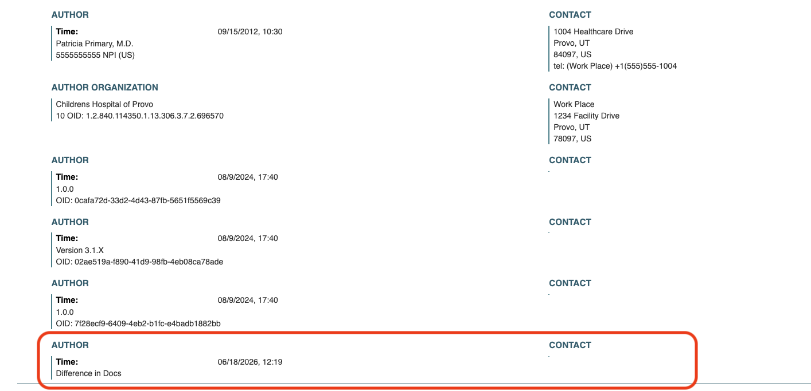

# Difference in Docs: HTML Generation of Augmented eCRs Spike
## Purpose
The purpose of this spike is to determine how an augmented eCR interacts with the code used to generate browser-viewable
HTML files for Electronic Case Reports

## How to generate an HTML file from an eCR
### Running the HTML generator via command line:

Command: `xsltproc --output <output-html> <xslt-stylesheet> <input-ecr>`

Arguments:
* `<output-html>`Path where the generated HTML will be written
* `<xslt-stylesheet>` Path to the HTML generation stylesheet (.xsl)
* `<input-ecr>` Path to the eICR/CDA document to process (.xml)

Example: `xsltproc --output html-gen/ecr.html html-gen/html-gen.xsl html-gen/augmented-ecr.xml`

Running the above command from root on the branch gordon/html-generation-spike-37 will create a viewable htmml at `html-gen/ecr.html`

## HTML Generation and Augmented eICRs

### What augmented information automatically appears in the generated HTML?
An augmented eCR fed into the html generator only shows a small amount of visible augmented information in two possible places.

First, The header level
author element appears in the authors list but is sparse on information (see below screenshot with augmented info highlighted)

Second, if an augmented author element is added to a Section level element such as a problem list it will create a
Section Author area. This section will not contain any information as the html template is seeking to display
`assignedAuthor/assignedPerson/name`, `assignedAuthor/assignedAuthoringDevice/softwareName`, or `assignedAuthor/id` if not nullFlavor,
none of which are contained in an augmented Author block.
(See below screenshot)

### What augmented information does not appear in the HTML?
Our most important augmentation information is obviously the entry-level author elements marking changes. Unfortunately
these are not present in the html in any way. The html draws almost entirely from the narrative sections of the eCR XML.
The html-like tables from the narrative text field are grabbed and displayed basically unchanged. Data from the structured entries
where our augmentations live is not directly shown anywhere

### How might we update html generation to flag changes
Example eCRs I've been examining while generating HTML files do contain linking information between the structured entries and the
narrative text tables. ID numbers correspond between narrative table rows and structured entries. It should be possible to use this link
to mark the html from the narrative in some way, whether that be text tags, highlighting, etc.

## Open Questions/Concerns
1. The test data we recently received from APHL which was used to create our example has marked changes between versions,
BUT those changes only exist in the structured entries and not in the narrative. Is this an artifact of the changes being hand created
with the corresponding narrative being overlooked? Even if that is the case here, is it possible for eCRs to have structured entry data that
does not have narrative counterparts? If so, displaying augmentations in the HTML will get significantly more complicated
2. How do we want to mark changes and additions in the html tables?
